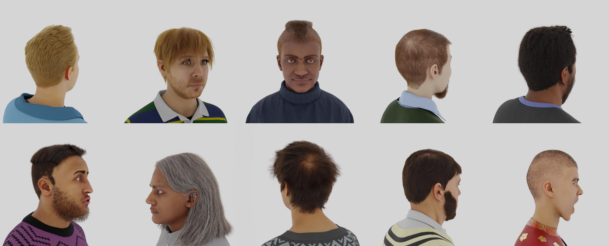

# GeoGen Dataset

The GeoGen dataset is a comprehensive collection of over 70,000 synthetic face images designed for advanced 3D geometry reconstruction research.

The dataset is essential for training deep learning models that are geared towards high-fidelity 3D facial geometry reconstruction.

 This dataset was introduced in our paper titled [GeoGen: Geometry-Aware Generative Modeling via Signed Distance Functions](https://microsoft.github.io/GeoGen) and can be used to train deep learning models for 3D Reconstruction.

The dataset contains:

- The dataset comprises 70,000 images distributed across 10,000 identities, with each identity represented by 7 unique images. These images are captured from various camera angles spanning a full 360-degree view to enhance the diversity and comprehensiveness of the dataset. The dataset includes the camera extrinsics and intrinsics in json format.

The GeoGen dataset can be used for **non-commercial** research, and is licensed under the license found in [LICENSE](LICENSE).

## Downloading the Dataset

For convenience the dataset is split into 7 parts and the last part contains the metadata with the camera parameters which can be downloaded here: 

7 images per identity

- [P1](https://facesyntheticspubwedata.blob.core.windows.net/wacv-2023/subjects_100000-133332_5_imgs.zip)
- [P2](https://facesyntheticspubwedata.blob.core.windows.net/wacv-2023/subjects_133333-166665_5_imgs.zip)
- [P3](https://facesyntheticspubwedata.blob.core.windows.net/wacv-2023/subjects_166666-199998_5_imgs.zip)
- [P4](https://facesyntheticspubwedata.blob.core.windows.net/wacv-2023/subjects_100000-133332_5_imgs.zip)
- [P5](https://facesyntheticspubwedata.blob.core.windows.net/wacv-2023/subjects_133333-166665_5_imgs.zip)
- [P6](https://facesyntheticspubwedata.blob.core.windows.net/wacv-2023/subjects_166666-199998_5_imgs.zip)
- [P7](https://facesyntheticspubwedata.blob.core.windows.net/wacv-2023/subjects_166666-199998_5_imgs.zip)


## Dataset Layout

The GeoGen dataset contains cropped color images in the following layout.

```
subj_id_n
├── 0.png                 # First rendered image of subject subj_id_n
├── 1.png                 # Second rendered image of subject subj_id_n
...
├── k.png                 # k+1 rendered image of subject subj_id_n
```

The extrinsics and intrinsics are in their respective metadata.json files in the following layout.


```
metadata_id_n_jsom

├── name of the subject                 # Corresponding name image of subject subj_id_n
├── cameras                             # Camera parameters of image of subject subj_id_n
...
├── k.png                 
```


For the camera parameters the average focal lenght is 50 and the sensor width is 36. 


## Disclaimer

Some of our rendered faces may be close in appearance to the faces of real people.
Any such similarity is naturally unintentional, as it would be in a dataset of real images, where people may appear similar to others unknown to them.

## Citation

If you use the GeoGen dataset in your work, please cite the following [paper](https://github.com/microsoft/GeoGen/raw/main/paper.pdf):

```
@inproceedings{esposito2024geogen,
  title={GeoGen: Geometry-Aware Generative Modeling via Signed Distance Functions},
  author={Esposito, Salvatore and Xu, Qingshan and Kania, Kacper and Hewitt, Charlie and Mariotti, Octave and Petikam, Lohit and Valentin, Julien and Onken, Arno and Mac Aodha, Oisin},
  booktitle={Proceedings of the IEEE/CVF Conference on Computer Vision and Pattern Recognition (CVPR) workshops},
  year={2024}
  organization={IEEE}
}
```
